<div align="center">

# 🚀 Kosuke Saito

### 『 Full-Stack Developer × AI Engineer × Cloud Architect 』

<p align="center">
  <a href="https://git.io/typing-svg">
    
  </a>
</p>


</div>

## 🎯 About Me

```python
class KosukeSaito:
    def __init__(self):
        self.name = "Kosuke Saito"
        self.role = "Full-Stack Developer & AI Engineer"
        self.language_spoken = ["Japanese", "English"]
        self.code = {
            "frontend": ["React", "Next.js", "TypeScript", "Vue.js", "Svelte"],
            "backend": ["Python", "Node.js", "FastAPI", "Django", "Express"],
            "database": ["PostgreSQL", "MongoDB", "Redis", "Neo4j"],
            "cloud": ["AWS", "GCP", "Azure", "Docker", "Kubernetes"],
            "ai_ml": ["PyTorch", "TensorFlow", "OpenAI", "LangChain", "Transformers"],
            "tools": ["Git", "Linux", "CI/CD", "Terraform", "Prometheus"]
        }
        self.current_focus = "Building next-gen AI applications"
        self.fun_fact = "I debug in my dreams 🌙"
    
    def say_hi(self):
        print("Thanks for dropping by! Let's build something amazing together! ✨")

me = KosukeSaito()
me.say_hi()
```

<div align="center">

## 📊 GitHub Analytics


</div>

## 🛠️ Tech Stack

<div align="center">

### 🎨 Frontend Magic
<p>
  
  
  
  
  
  
</p>

### ⚡ Backend Power
<p>
  
  
  
  
  
  
</p>

### 🗄️ Database & Storage
<p>
  
  
  
  
  
</p>

### ☁️ Cloud & DevOps
<p>
  
  
  
  
  
  
</p>

### 🤖 AI & Machine Learning
<p>
  
  
  
  
  
  
</p>

</div>

## 🌟 Featured Projects

<div align="center">

### 🎨 Project Showcase

<a href="https://github.com/Kohsuk3/project1">
  
</a>

<a href="https://github.com/Kohsuk3/project2">
  
</a>

</div>

## 🔥 Recent Activity

<div align="center">

<!--START_SECTION:activity-->

<!--END_SECTION:activity-->

</div>

## 🏆 GitHub Trophies

<div align="center">


</div>

## 📈 Contribution Graph

<div align="center">


</div>

## 🎵 Now Playing

<div align="center">

[](https://open.spotify.com/user/your-spotify-id)

</div>

## 🐍 Contribution Snake

<div align="center">

<picture>
  <source media="(prefers-color-scheme: dark)" srcset="https://raw.githubusercontent.com/Kohsuk3/Kohsuk3/output/github-contribution-grid-snake-dark.svg">
  <source media="(prefers-color-scheme: light)" srcset="https://raw.githubusercontent.com/Kohsuk3/Kohsuk3/output/github-contribution-grid-snake.svg">
  
</picture>

</div>

## 🎯 Current Focus

```mermaid
graph TD
    A[🤖 AI Engineering] --> B[🧠 Large Language Models]
    A --> C[🔍 Computer Vision]
    A --> D[📊 MLOps & AutoML]
    
    E[☁️ Cloud Architecture] --> F[🐳 Containerization]
    E --> G[📈 Scalable Systems]
    E --> H[🔐 Security & Compliance]
    
    I[🌐 Full-Stack Development] --> J[⚡ Performance Optimization]
    I --> K[🎨 UI/UX Excellence]
    I --> L[🔧 Developer Experience]
    
    style A fill:#36BCF7,stroke:#333,stroke-width:2px,color:#fff
    style E fill:#36BCF7,stroke:#333,stroke-width:2px,color:#fff
    style I fill:#36BCF7,stroke:#333,stroke-width:2px,color:#fff
```

<div align="center">



</div>

## 💫 Let's Connect

<div align="center">

<p align="center">
  <a href="mailto:your.email@example.com">
    
  </a>
  <a href="https://linkedin.com/in/your-profile">
    
  </a>
  <a href="https://twitter.com/your-handle">
    
  </a>
  <a href="https://your-portfolio.com">
    
  </a>
  <a href="https://dev.to/your-username">
    
  </a>
</p>

### 💬 Random Dev Quote


### 📊 Profile Views

<p align="center">
  
</p>


---

<div align="center">

**🌟 "Building the future, one commit at a time" 🌟**

*Made with ❤️ and lots of ☕*

</div>

</div>